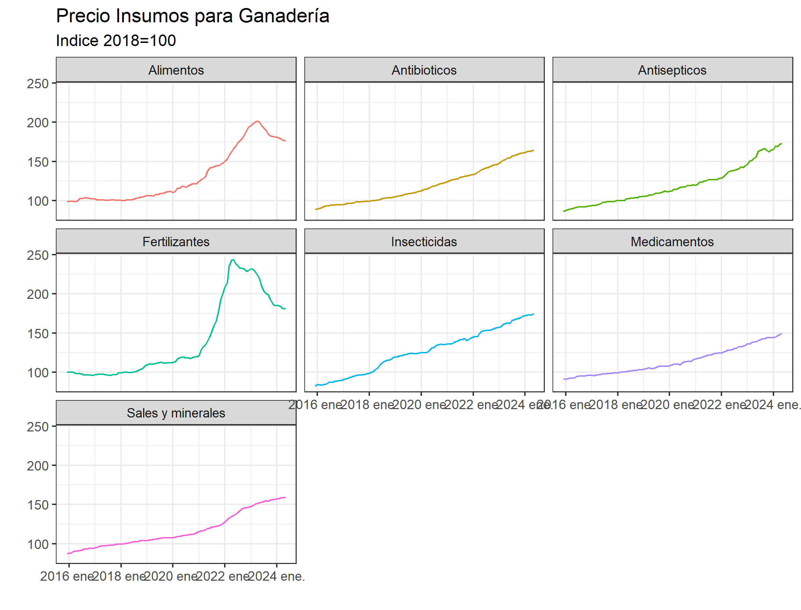
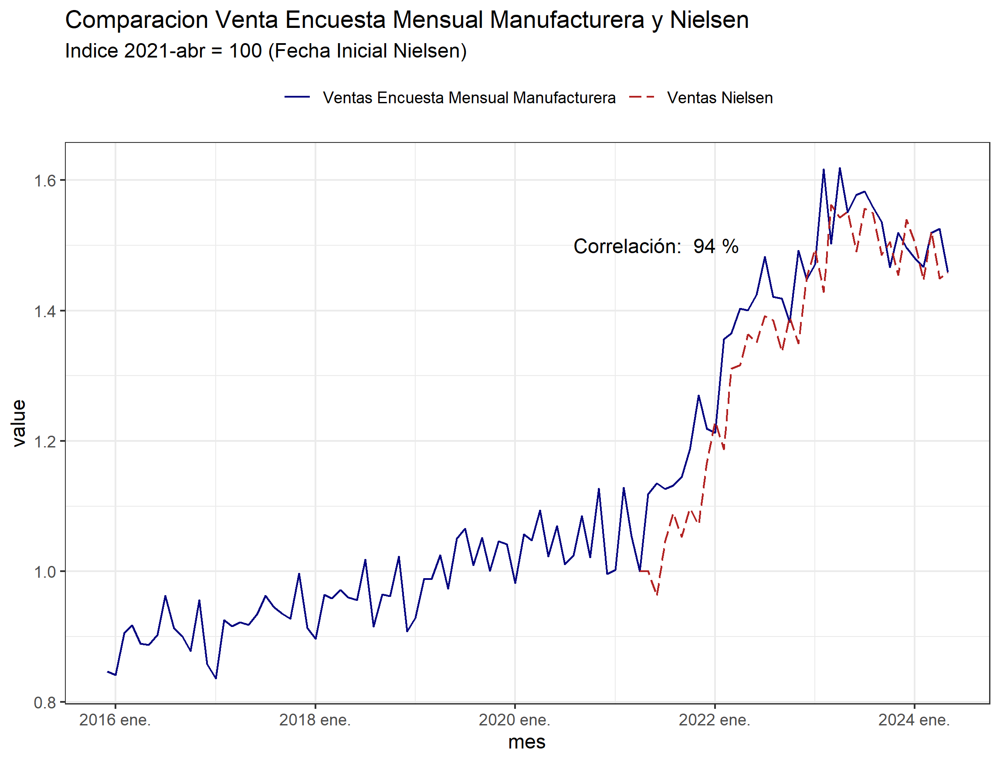
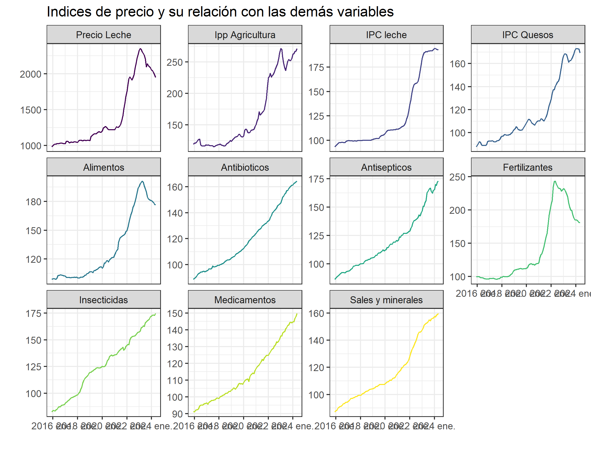
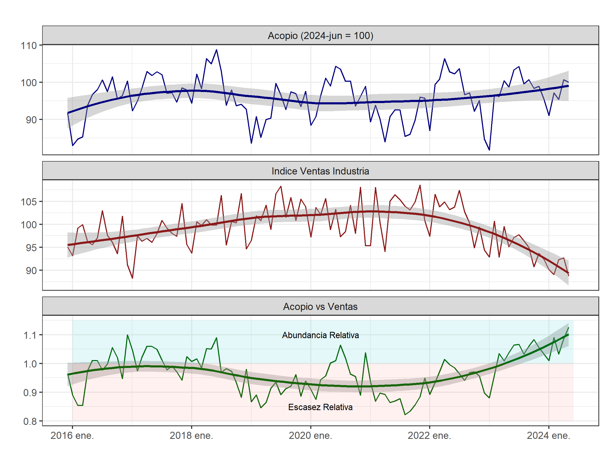
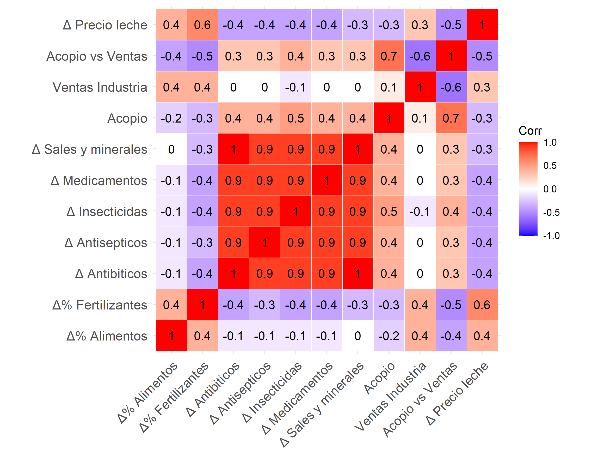
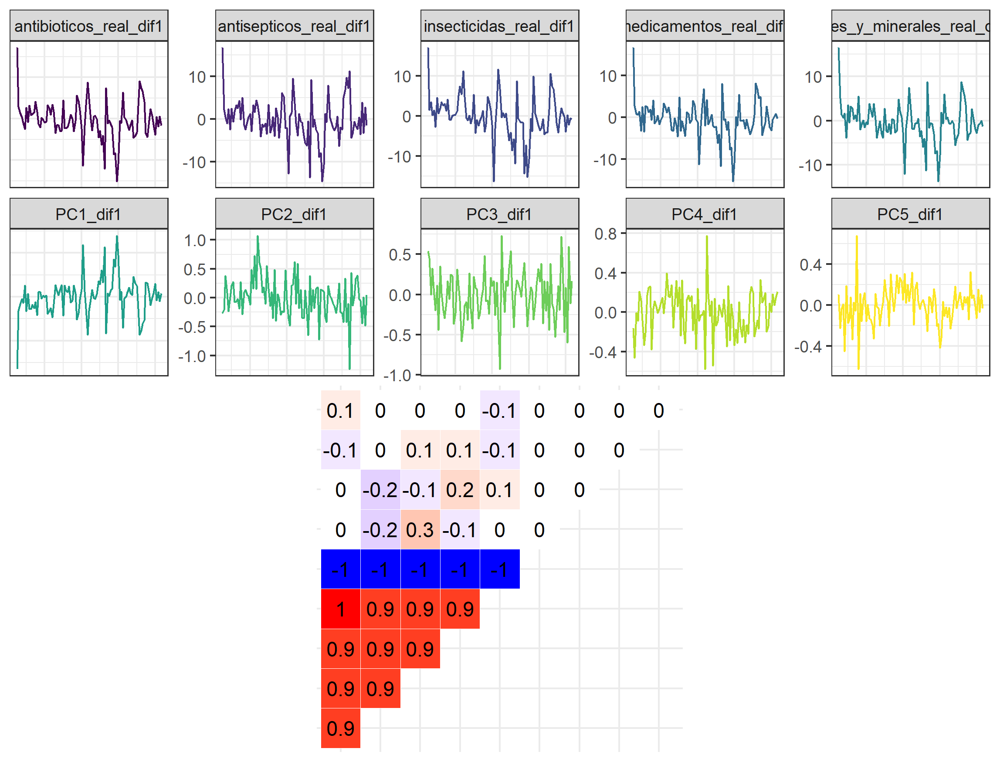
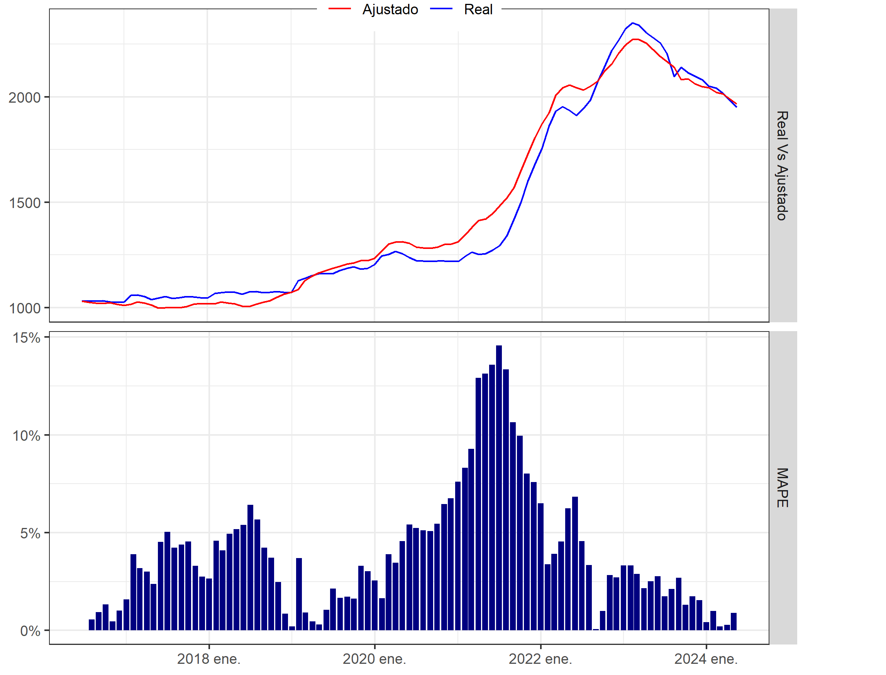
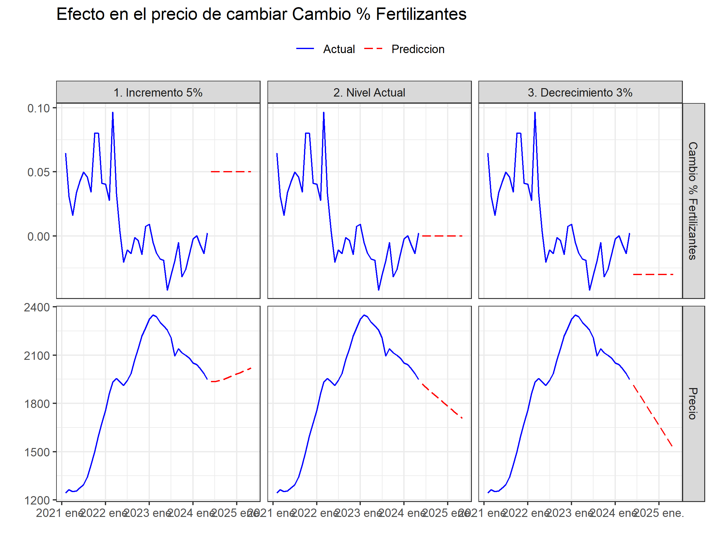
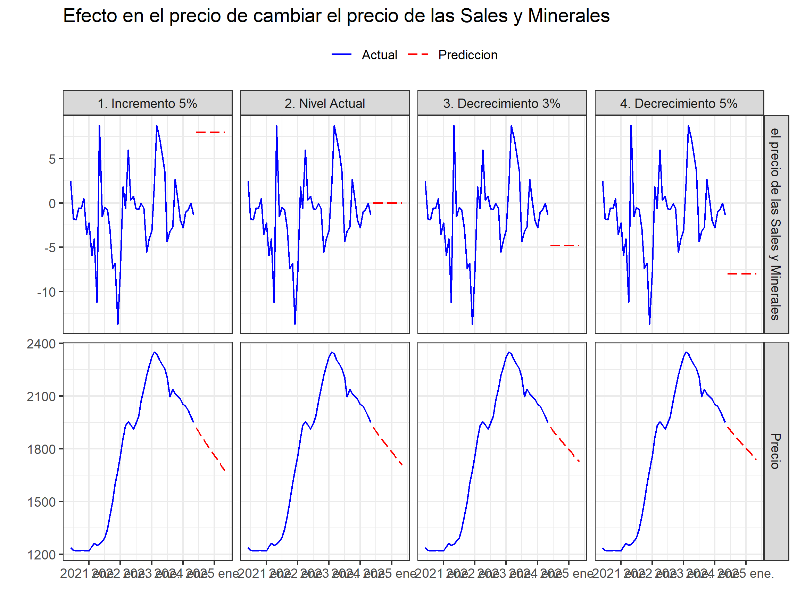
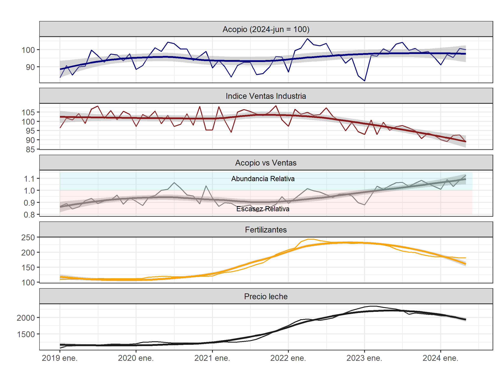

# Colombian Milk Price Analysis
Augusto Umaña

# README

## Introduction

This repository holds the final presentation from a project developed
for a client in Colombia interested in understanding the macroeconomic
determinants of raw milk prices — specifically, the price paid to dairy
farmers. The objective was to identify and analyze publicly available
data sources that could help explain the main factors influencing raw
milk pricing in the country.

Although the original project was conducted entirely in Spanish, this
repository has been created in English to serve as part of my
professional portfolio on [Upwork](https://www.upwork.com). The full
scope of the project includes the end-to-end processing of primary data
sources — from downloading and cleaning raw data to transforming and
consolidating it into parquet files suitable for analysis and modeling.

The project combines scripts developed in **Python** and **R**. However,
I made this specific presentation in **R** using the **Quarto** document
format. This enabled the seamless generation of this HTML report and a
PowerPoint presentation from the same script, only changing a few
parameters (see the file
`Final Analysis and presentation PowerPoint.pptx`).

### Key Files in This Repository

- **`Final Analysis and Presentation.qmd`**  
  Quarto source file used to generate this README document in HTML
  format.

- **`Final Analysis and Presentation PowerPoint.qmd`**  
  A nearly identical version of the source code, configured to output a
  PowerPoint presentation instead of HTML.

- **`AnalyticalInsights.potx`**  
  PowerPoint template used to format the final presentation. This file
  can be easily customized with the client’s branding and color scheme
  without modifying the source code.

## Objective of the Analysis: Understand the key factors driving raw milk price trends

### Since 2016, the price of raw milk in Colombia has followed four distinct phases:

<div class="incremental">

- **2016–2018: Moderate and steady monthly increases**  
  A period of gradual growth, likely tied to normal market dynamics and
  seasonal factors.

- **2019–2021: Sharper increases with occasional sudden spikes**  
  Marked by more volatility, possibly linked to supply disruptions or
  short-term demand shifts.

- **2021–2023: Exponential price growth**  
  Driven by structural shocks in the agricultural sector, including:  
  • The nationwide strike in May 2021, which disrupted supply chains.  
  • A sharp rise in global input costs (e.g., fertilizers, feed)
  following the war in Ukraine.  
  • Broader domestic inflation affecting transportation and production
  costs.

- **2023–Present: Deflationary phase**  
  Characterized by falling input prices, tighter monetary policy, and
  weakened consumer demand—particularly in dairy categories.

</div>

``` r
acopio_leche |> 
  ggplot(aes(x=mes, y=precio))+
  geom_line(color = "navy")+
  labs(title = "Precio de la leche",
       x = "Mes")+
  scale_y_continuous(name= "Precio leche pagado al productor", labels = scales::dollar_format(), limits = c(800, 2500))+
  
  theme_bw()
```


## **Key Variables Considered in the Analysis**

**Identifying the main drivers of raw milk price fluctuations**

The analysis focused on identifying variables with a direct influence on
the price of raw milk:

- **Input Prices**  
  We used data from DANE’s SIPSA system, filtering specifically for
  agricultural inputs relevant to milk production (e.g., animal feed,
  fertilizers, supplements).

- **Demand-Side Variables**  
  Raw milk prices are partially driven by consumer demand for liquid
  milk and dairy products such as cheese and yogurt. To capture this
  dynamic, we used the Monthly Manufacturing Survey (EMM) from DANE,
  which reports monthly production and sales across manufacturing
  sectors, including dairy processing.

- **Inflation Indicators**  
  Given the inflationary pressures between 2021 and 2023, we included
  key inflation metrics:  
  • **CPI (Consumer Price Index)**  
  • **CPI for milk and cheese**  
  • **Agricultural PPI (Producer Price Index)**

## Input Prices

SIPSA Data – Agricultural Input Cost Monitoring

Input price data was sourced from SIPSA (the Agricultural Sector Price
and Supply Information System), managed by DANE. This system tracks
monthly price variations across the entire agricultural supply chain.

For this analysis, we selected only those inputs directly related to raw
milk production and grouped them into seven main categories to
facilitate interpretation and modeling.

``` r
acopio_leche |> select(mes, 
                       Alimentos = indice_base_201803_alimentos,
                       Antibioticos = indice_base_201803_antibioticos,
                       Antisepticos = indice_base_201803_antisepticos,
                       Fertilizantes = indice_base_201803_fertilizantes,
                       Insecticidas = indice_base_201803_insecticidas,
                       Medicamentos = indice_base_201803_medicamentos,
                       `Sales y minerales` = indice_base_201803_sales_y_minerales) |>
  pivot_longer(-mes) |> 
  ggplot(aes(x=mes, y=value, color = name))+
  geom_line()+
  facet_wrap(~name)+
  ggtitle("Precio Insumos para Ganadería", "Indice 2018=100")+
  labs(x = "", y = "")+
  theme_bw()+
  theme(legend.position = "none")
```



## **Demand Variables**

**Capturing Dairy Sector Activity through Official Manufacturing Data**

To model demand-side dynamics, we used data from the **Monthly
Manufacturing Survey** (EMM), specifically the dairy sector chapter.
This survey tracks monthly production and sales volumes across all
sectors of the economy and provides a long historical series (available
since January 2001).

For our purposes, it offers a comprehensive view of the output of dairy
products and their derivatives (e.g., cheese, yogurt, condensed milk),
making it a robust proxy for downstream demand.

While Nielsen data is also available, it presents two key limitations:  
- It only covers the last **three years**.  
- It focuses exclusively on the **liquid milk** segment, and only for
the specific sales channels accessed by **Alquería**.

``` r
variables_base <- acopio_leche |> 
  filter(mes == yearmonth("2021-04-01")) |> 
  select(valor_ventas_base   = valor_ventas_consumidor, 
         volumen_ventas_base = volumen_ventas_consumidor,
         
         indice_ventas_base = indice_ventas_nominales,
         indice_ventas_reales_base = indice_ventas_reales_x)

df_comparacion_ventas <- 
acopio_leche |> select(mes, 
                       valor_ventas_consumidor, 
                       volumen_ventas_consumidor,
                       indice_ventas_nominales, 
                       indice_ventas_reales_x) |> 
  cross_join(variables_base) |> 
  mutate(valor_ventas_consumidor = valor_ventas_consumidor/valor_ventas_base,
         indice_ventas_nominales = indice_ventas_nominales/indice_ventas_base,
         
         indice_ventas_reales = indice_ventas_reales_x/indice_ventas_reales_base,
         volumen_ventas_consumidor = volumen_ventas_consumidor/volumen_ventas_base
         ) |>
  select(mes,
         `Ventas Nielsen` =  valor_ventas_consumidor,
         `Ventas Encuesta Mensual Manufacturera` =indice_ventas_nominales,
         `Volumen Nielsen` = volumen_ventas_consumidor,
         `Volúmen Encuesta Mensual Manufacturera` = indice_ventas_reales,
         ) 


correlacion <- 
  df_comparacion_ventas |> 
  select(-mes) |> 
  drop_na() |> 
  cor()

colores <- c("Ventas Nielsen" = "firebrick", "Ventas Encuesta Mensual Manufacturera" = "navy")
tipo_linea <- c("Ventas Nielsen" = 5, "Ventas Encuesta Mensual Manufacturera" =1)

df_comparacion_ventas |> select(mes, `Ventas Nielsen`, `Ventas Encuesta Mensual Manufacturera`) |>
  pivot_longer(-mes) |> 
  ggplot(aes(x=mes, y=value, color = name, linetype = name))+
  geom_line()+
  annotate('text', label = paste("Correlación: ", round(100*correlacion[2], digits = 0), "%"),
           x=yearmonth("2021-06"), 
           y = 1.5)+
  ggtitle("Comparacion Venta Encuesta Mensual Manufacturera y Nielsen", "Indice 2021-abr = 100 (Fecha Inicial Nielsen)")+
  theme_bw()+
  scale_color_manual(values = colores)+
  scale_linetype_manual(values = tipo_linea)+
  theme(legend.position = "top", legend.title = element_blank())
```

    Warning: Removed 64 rows containing missing values or values outside the scale range
    (`geom_line()`).



## **Inflation Variables**

**Controlling for Price Level Effects through Deflation and
Differencing**

All price-related variables show high correlation—both in their overall
trend and their shape over time. This strong co-movement reflects the
broad inflationary dynamics affecting the economy.

To isolate the true drivers of raw milk price behavior, we applied two
standard data transformations:

- **Deflation**: All monetary variables were converted to real terms
  (constant prices) to remove the effects of general inflation.
- **Differencing**: We used changes in prices (month-over-month
  differences) rather than absolute levels, since what truly matters is
  the **variation** in input costs and demand—not their nominal value.

These transformations help ensure a more accurate and meaningful
analysis.

``` r
acopio_leche |> 
  select(mes, 
         `Precio Leche`      = precio,
         `Ipp Agricultura`   = ipp_agricultura, 
         `IPC leche`         = indice_ipc_leche, 
         `IPC Quesos`        = indice_ipc_quesos,
         Alimentos           = indice_base_201803_alimentos,
         Antibioticos        = indice_base_201803_antibioticos,
         Antisepticos        = indice_base_201803_antisepticos,
         Fertilizantes       = indice_base_201803_fertilizantes,
         Insecticidas        = indice_base_201803_insecticidas,
         Medicamentos        = indice_base_201803_medicamentos,
         `Sales y minerales` = indice_base_201803_sales_y_minerales) |> 
  pivot_longer(-mes) |>
  mutate(name = factor(name, 
                       levels = c("Precio Leche", 
                                  "Ipp Agricultura", 
                                  "IPC leche", "IPC Quesos", 
                                  "Alimentos", 
                                  "Antibioticos", 
                                  "Antisepticos", 
                                  "Fertilizantes", 
                                  "Insecticidas", 
                                  "Medicamentos", 
                                  "Sales y minerales"),
                       ordered = TRUE)) |> 
  ggplot(aes(x=mes, y = value, color = name))+
  geom_line()+
  ggtitle("Indices de precio y su relación con las demás variables")+
  facet_wrap(~name, scales = "free_y")+
  labs(x="", y ="")+
  theme_bw()+
  theme(legend.position = "none")
```



## **Constructed Variable: Milk Collection-to-Sales Ratio**

**Measuring Relative Supply Pressure in the Raw Milk Market**

In economics, **price reflects the relative scarcity or abundance** of a
good. For the raw milk market, this scarcity is defined not in absolute
terms, but **relative to downstream demand** for dairy products.

To capture this relationship, we constructed a ratio that compares raw
milk supply to industrial demand:

- **Milk Collection**: Sourced from the **USP (Unidad de Seguimiento de
  Precios)** report by the Ministry of Agriculture.
- **Dairy Sales**: Based on **real (inflation-adjusted) sales** reported
  in the Monthly Manufacturing Survey (EMM) by DANE.

The resulting variable is defined as:
$\text{Milk Collection-to-Industry Sales}\_{t} = \frac{MilkCollection_{t}}{RealSales_{t}}$

This ratio helps assess whether the market is experiencing **excess
supply or tight availability**, which can directly influence pricing
behavior.

``` r
colores =c("Acopio (2024-jun = 100)" = "navy",
           "Indice Ventas Industria" = "firebrick4",
           "Acopio vs Ventas"        = "darkgreen")

df_abunancia_escasez <- 
  tibble(
    name = factor(c("Acopio vs Ventas","Acopio vs Ventas"),
                  levels = c("Acopio (2024-jun = 100)",
                             "Indice Ventas Industria",
                             "Acopio vs Ventas"),
           ordered = TRUE),
    label = c("Abundancia Relativa", "Escasez Relativa"),
    yminimo=c(1, 0.8),
    ymaximo=c(1.15, 1),
    y_label = c(1.1, 0.85),
    xminimo = c(yearmonth("2016-01"),yearmonth("2016-01")),
    xmaximo = c(yearmonth("2024-06"),yearmonth("2024-06")),
    fill = c("indianred1", "darkseagreen1")
  )

acopio_leche |> 
  select(mes, 
         `Acopio (2024-jun = 100)` = volumen_base_202406,
         `Indice Ventas Industria` = indice_ventas_reales_y,
         `Acopio vs Ventas` = acopio_vs_ventas_industria
         ) |> 
  pivot_longer(-mes) |>
  mutate(name = factor(name,
                       levels = c("Acopio (2024-jun = 100)",
                                  "Indice Ventas Industria",
                                  "Acopio vs Ventas"),
                       ordered = TRUE)) |>
  
  ggplot(aes(x=mes, y = value, color = name))+
  geom_line()+
  geom_smooth()+
  
  geom_rect(data = df_abunancia_escasez,
              aes(ymin = yminimo,
                  ymax = ymaximo,
                  xmin = xminimo,
                  xmax = xmaximo,
                  fill = fill),
              alpha = 0.1,
              inherit.aes = FALSE)+

  geom_text(data = df_abunancia_escasez,
                  aes(x = xminimo + round(0.5*(xmaximo - xminimo), 0),
                      y = y_label,
                      label = label),
            color = "black",
            size = 8,
            size.unit = "pt"
            )+
  
  scale_color_manual(values = colores)+

  labs(title = "", x="", y = "")+
  facet_wrap(~name, scales = "free_y", ncol = 1, nrow = 3)+
  theme_bw()+
  theme(legend.position = "none")
```

    `geom_smooth()` using method = 'loess' and formula = 'y ~ x'



## **Correlation Challenges: Multicollinearity**

**Navigating variable redundancy and spurious results**

The initial analysis considered more than **190 variables**. After
variable selection and refinement, we identified **10 key drivers** that
best explain raw milk price behavior.

However, several of these variables are highly correlated with each
other, raising issues of **multicollinearity**:

- **Industry Sales**, **Milk Collection Volume**, and the
  **Collection-to-Sales Ratio** all show strong correlations with raw
  milk price—but are also strongly correlated among themselves.  
- **Changes in input prices** (month-over-month) also exhibit high
  inter-correlation, particularly among similar categories (e.g.,
  different types of feed and supplements). This can lead to **spurious
  results** in modeling and weaken interpretability.

Despite this, two input price variables stand out:  
- **Percent change in fertilizer prices**  
- **Percent change in feed prices**

Both show **strong correlation with raw milk prices** and **low
correlation with other input variables**, making them more reliable
predictors in the model.

``` r
acopio_leche |>
  select(
    `Δ% Alimentos` = precio_pct_alimentos,
    `Δ% Fertilizantes` = precio_pct_fertilizantes,

    `Δ Antibiticos` = antibioticos_real_dif1,
    `Δ Antisepticos` = antisepticos_real_dif1,
    `Δ Insecticidas` = insecticidas_real_dif1,
    `Δ Medicamentos` = medicamentos_real_dif1,
    `Δ Sales y minerales` = sales_y_minerales_real_dif1,
    
    `Acopio` = volumen_base_202406,
    `Ventas Industria` = indice_ventas_reales_y,
    `Acopio vs Ventas` = acopio_vs_ventas_industria,
    
    `Δ Precio leche` = precio_dif1,
  ) |>
  cor( use = "pairwise") |> 
  ggcorrplot(lab = TRUE,
             outline.col = "white", 
             digits = 1)
```



## **Addressing Correlation Issues: Principal Component Analysis (PCA)**

**Reducing input price redundancy through dimensionality reduction**

To address the multicollinearity problem among input price variables, we
applied **Principal Component Analysis (PCA)**.

PCA transforms the original variables into new, uncorrelated components
that retain the majority of the original information. Each **principal
component** is a linear combination of the original variables and
satisfies two key conditions:

- **Independence**: The components are uncorrelated with each other.  
- **Variance Maximization**: Each component captures the maximum
  possible variance (i.e., information) from the data.

In the chart, we observe that the **first principal component
(PC1_dif1)** captures **96% of the total variance** from the five
original variables. This makes it a highly efficient summary of the
dynamics in input price changes, and a robust input for modeling.

``` r
variables_insumos <-  c("antibioticos_real_dif1",
                        "antisepticos_real_dif1",
                        "insecticidas_real_dif1",
                        "medicamentos_real_dif1",
                        "sales_y_minerales_real_dif1"
                        )


df_insumos_dif1 <-
  agregar_componentes_principales(acopio_leche,variables_insumos, "_dif1")

componentes_principales <- acopio_leche |> 
  select(all_of(variables_insumos)) |> drop_na() |>
  prcomp(scale. = TRUE)

ggcomponentes <- df_insumos_dif1 |> 
  pivot_longer(-mes) |>
  mutate(name = factor(name,
                       levels = c("antibioticos_real_dif1",
                                  "antisepticos_real_dif1",
                                  "insecticidas_real_dif1",
                                  "medicamentos_real_dif1",
                                  "sales_y_minerales_real_dif1",
                                  "PC1_dif1",
                                  "PC2_dif1",
                                  "PC3_dif1",
                                  "PC4_dif1",
                                  "PC5_dif1"),
                       ordered = TRUE)) |>
  ggplot(aes(x=mes, y=value, color = name))+
  geom_line()+
  facet_wrap(~name, scales = "free_y", ncol = 5)+
  theme_bw()+
  theme(legend.position = "none")

ggcorr_componentes <- df_insumos_dif1 |> 
  select(-mes) |> 
  cor() |>
  ggcorrplot(lab = TRUE, outline.col = "white", digits = 1, type = "upper")


ggmatrix(list(ggcomponentes, 
              ggcorr_componentes), 
         ncol = 1, 
         nrow = 2,
         showAxisPlotLabels = FALSE)
```



## **Model Fit**

**Explaining price movements through a linear regression model**

To explain the variation in raw milk prices, we estimated a **linear
regression model** using the **monthly change in price** as the
dependent variable. The model includes:

- **Two lags of the price change**, to capture autocorrelation and
  short-term dynamics.

- **Exogenous explanatory variables**, selected based on economic
  reasoning and statistical performance:

  - **Milk Collection-to-Sales Ratio**  
  - **Percent change in fertilizer prices**  
  - **First principal component** summarizing the remaining input prices

This specification balances interpretability with predictive power and
controls for multicollinearity through PCA.

``` r
train <- acopio_leche |> 
  select(mes,
         precio,
         precio_dif1,
         precio_dif1_lag_1,
         precio_dif1_lag_2,
         acopio_vs_ventas_industria,
         precio_pct_alimentos,
         precio_pct_fertilizantes) |> 
  left_join(df_insumos_dif1 |> 
              select(starts_with("PC"), mes), by = "mes") 

fomula_modelo_ar1_noPC1_lagged <- 
  formula(precio_dif1~ 
          precio_dif1_lag_1 +
          #precio_dif1_lag_2 +
          acopio_vs_ventas_industria +
          #precio_pct_alimentos +
          precio_pct_fertilizantes+
          PC1_dif1
          )

modelo_ar1_noPC1_lagged <- lm(fomula_modelo_ar1_noPC1_lagged, data = train, y=TRUE)

valores_reales_ajustados <- 
train |> 
  select(mes,precio, precio_dif1) |> drop_na() |>
  bind_cols(as_tibble(modelo_ar1_noPC1_lagged$fitted.values) |>  
              rename(precio_dif1_fitted = value)) |>
  mutate(precio_fitted = cumsum(ifelse(mes == yearmonth("2016-07-01"), 
                                       precio, 
                                       precio_dif1_fitted)) )

gr_precio_real_vs_Ajustado <- valores_reales_ajustados |> 
  select(mes, precio, precio_fitted) |>
  ggplot(aes(x = mes)) +
  geom_line(aes(y = precio, color = "Real")) +
  geom_line(aes(y = precio_fitted, color = "Ajustado")) +
  labs(title = "Precio Real vs Ajustado",
       x = "Mes",
       y = "Precio") +
  scale_color_manual(values = c("Real" = "blue", "Ajustado" = "red"))+
  theme_bw()+
  theme(legend.position = "top", legend.title = element_blank())

gr_MAPE <- valores_reales_ajustados |> 
  mutate(error_pct = abs(precio_fitted-precio)/precio) |> 
  ggplot(aes(x=mes, y = error_pct))+
  geom_col(fill = "navy")+
  scale_y_continuous(name = "MAPE", labels = scales::label_percent())+
  ggtitle("Error Absoluto Promedio (MAPE)")+
  labs(x="")+
  theme_bw()

ggmatrix(list(gr_precio_real_vs_Ajustado, gr_MAPE), ncol = 1, nrow = 2, showAxisPlotLabels = TRUE, showYAxisPlotLabels = TRUE, showStrips = TRUE, legend = c(1,1), yAxisLabels = c("Real Vs Ajustado", "MAPE"))
```



## **Fitted Model**

**Specification of the linear regression model**

The final model used to explain changes in the price of raw milk is
specified as follows: $$
\Delta \text{Price}_t = \alpha_0 + \alpha_1 \Delta \text{Price}_{t-1} + \alpha_2 \Delta \text{Price}_{t-2} + \beta_1 \text{Collection-to-Sales}_t + \beta_2 \Delta \% \text{Fertilizer}_t + \beta_3 \text{PC1}
$$

Where:

- $\Delta \text{Price}_t$: Monthly change in raw milk price

- $\Delta \text{Price}_{t-1},* \Delta \text{Price}_{t-2}$: Lagged
  changes in price

- $\text{Collection-to-Sales}_t$: Ratio of milk collected to real
  industrial sales

- $\Delta \text{% Fertilizer}_t$: Monthly percent change in fertilizer
  prices

- $\text{PC1}$: First principal component summarizing changes in other
  input prices

This model structure allows us to capture both **price inertia** and the
**exogenous economic forces** that influence pricing in the raw milk
market.

``` r
tab_model(modelo_ar1_noPC1_lagged, show.se = FALSE, show.stat = TRUE, show.ci = FALSE)
```

<table data-quarto-postprocess="true"
style="border-collapse:collapse; border:none;">
<colgroup>
<col style="width: 25%" />
<col style="width: 25%" />
<col style="width: 25%" />
<col style="width: 25%" />
</colgroup>
<tbody>
<tr class="odd">
<td data-quarto-table-cell-role="th"
style="text-align: center; border-top: double; font-style: normal; font-weight: bold; padding: 0.2cm;"> </td>
<td colspan="3" data-quarto-table-cell-role="th"
style="text-align: center; border-top: double; font-style: normal; font-weight: bold; padding: 0.2cm;">precio
dif 1</td>
</tr>
<tr class="even">
<td
style="text-align: center; border-bottom: 1px solid; font-style: italic; font-weight: normal;">Predictors</td>
<td
style="text-align: center; border-bottom: 1px solid; font-style: italic; font-weight: normal;">Estimates</td>
<td
style="text-align: center; border-bottom: 1px solid; font-style: italic; font-weight: normal;">Statistic</td>
<td
style="text-align: center; border-bottom: 1px solid; font-style: italic; font-weight: normal;">p</td>
</tr>
<tr class="odd">
<td
style="text-align: left; padding: 0.2cm; vertical-align: top;">(Intercept)</td>
<td
style="text-align: left; padding: 0.2cm; vertical-align: top;">80.43</td>
<td
style="text-align: left; padding: 0.2cm; vertical-align: top;">2.00</td>
<td
style="text-align: left; padding: 0.2cm; vertical-align: top;"><strong>0.048</strong></td>
</tr>
<tr class="even">
<td
style="text-align: left; padding: 0.2cm; vertical-align: top;">precio
dif1 lag 1</td>
<td
style="text-align: left; padding: 0.2cm; vertical-align: top;">0.48</td>
<td
style="text-align: left; padding: 0.2cm; vertical-align: top;">5.75</td>
<td
style="text-align: left; padding: 0.2cm; vertical-align: top;"><strong>&lt;0.001</strong></td>
</tr>
<tr class="odd">
<td
style="text-align: left; padding: 0.2cm; vertical-align: top;">acopio vs
ventas<br />
industria</td>
<td
style="text-align: left; padding: 0.2cm; vertical-align: top;">-79.82</td>
<td
style="text-align: left; padding: 0.2cm; vertical-align: top;">-1.96</td>
<td
style="text-align: left; padding: 0.2cm; vertical-align: top;">0.053</td>
</tr>
<tr class="even">
<td
style="text-align: left; padding: 0.2cm; vertical-align: top;">precio
pct fertilizantes</td>
<td
style="text-align: left; padding: 0.2cm; vertical-align: top;">292.30</td>
<td
style="text-align: left; padding: 0.2cm; vertical-align: top;">2.17</td>
<td
style="text-align: left; padding: 0.2cm; vertical-align: top;"><strong>0.033</strong></td>
</tr>
<tr class="odd">
<td style="text-align: left; padding: 0.2cm; vertical-align: top;">PC1
dif1</td>
<td
style="text-align: left; padding: 0.2cm; vertical-align: top;">1.75</td>
<td
style="text-align: left; padding: 0.2cm; vertical-align: top;">1.48</td>
<td
style="text-align: left; padding: 0.2cm; vertical-align: top;">0.142</td>
</tr>
<tr class="even">
<td
style="text-align: left; padding: 0.2cm; vertical-align: top; padding-top: 0.1cm; padding-bottom: 0.1cm; border-top: 1px solid;">Observations</td>
<td colspan="3"
style="text-align: left; padding: 0.2cm; vertical-align: top; padding-top: 0.1cm; padding-bottom: 0.1cm; border-top: 1px solid;">95</td>
</tr>
<tr class="odd">
<td
style="text-align: left; padding: 0.2cm; vertical-align: top; padding-top: 0.1cm; padding-bottom: 0.1cm;">R<sup>2</sup>
/ R<sup>2</sup> adjusted</td>
<td colspan="3"
style="text-align: left; padding: 0.2cm; vertical-align: top; padding-top: 0.1cm; padding-bottom: 0.1cm;">0.568
/ 0.549</td>
</tr>
</tbody>
</table>

# Simulation Results

## **Impulse-Response: Milk Collection-to-Sales Ratio**

We performed a simulation to analyze how different levels of the
**Collection-to-Sales Ratio** affect raw milk price over time, assuming
other factors remain constant.

#### Key scenarios:

- **Current situation maintained** (collection-to-sales remains at
  current level):  
  → Price converges to approximately **COP 1,665**

- **Improved balance in the market** (ratio reaches 1):  
  → Price stabilizes at the **current level of COP 1,870**

- **Milk shortage scenario** (due to reduced collection or stronger
  demand from industry):  
  → Price increases and stabilizes around **COP 2,076**

This simulation highlights the **sensitivity of price to supply-demand
balance** in the raw milk market and underscores the role of commercial
demand dynamics in price formation.

``` r
colores <- c("Actual" = "blue", "Prediccion" = "red") 
tipo_linea <- c("Actual" = 1, "Prediccion" = 5) 

simulacion_acopio_ventas <- simulacion_niveles(df = acopio_leche,
                   variable_impulso = "acopio_vs_ventas_industria",
                   label_variable = "Acopio vs Ventas",
                   
                   modelo_lineal =  modelo_ar1_noPC1_lagged, 
                   componentes_principales = componentes_principales,
                   
                   magnitud_impulsos = c(0, 
                                          -0.1, 
                                          -0.2),
                   
                   labels_impulsos = c("1. Nivel Actual", 
                                       "2. Decrecimiento 10%", 
                                       "3. Decrecimiento 20%"),
                   iteraciones = 12,
                   ultimas_obs = 42,
                   duracion_impulso = 12,
                   
                   colores = colores ,
                   tipo_linea= tipo_linea 
                   
                   )

  print(simulacion_acopio_ventas[[2]])
```


## **Simulation Results**

**Impulse-Response: Fertilizer Prices**

We simulated the effect of different fertilizer price scenarios on the
future trajectory of raw milk prices, holding other variables constant.

#### Key scenarios:

- **+5% increase in fertilizer prices** (similar to 2021–2022 surge):  
  → Milk price stabilizes around **COP 1,956**, halting the current
  downward trend.

- **No change in fertilizer prices** (status quo):  
  → Milk price continues its decline, reaching approximately **COP
  1,665** within a year.

- **Decrease in fertilizer prices**:  
  → Milk price drops further and stabilizes near **COP 1,490**

These results confirm the **strong short-term pass-through** from input
cost shocks—particularly fertilizers—into raw milk pricing dynamics.

``` r
simulacion_fertilizantes <- simulacion_niveles(df = acopio_leche,
                   variable_impulso = "precio_pct_fertilizantes",
                   label_variable = "Cambio % Fertilizantes",
                   
                   modelo_lineal =  modelo_ar1_noPC1_lagged, 
                   componentes_principales = componentes_principales,
                   
                   magnitud_impulsos = c(0.05, 
                                          0, 
                                          -0.03),
                   
                   labels_impulsos = c("1. Incremento 5%", 
                                       "2. Nivel Actual", 
                                       "3. Decrecimiento 3%"),
                   iteraciones = 12,
                   ultimas_obs = 40,
                   duracion_impulso = 12,
                   
                   colores = colores ,
                   tipo_linea= tipo_linea 
                   
                   )

print(simulacion_fertilizantes[[2]])
```



## **Simulation Results**

**Impulse-Response: Antibiotic Prices (and Other Inputs)**

We evaluated the impact of small fluctuations in antibiotic
prices—representative of other secondary inputs—on raw milk prices.

#### Key findings:

- For changes in the range of **−5% to +5%** in antibiotic prices:  
  → The impact on raw milk price is **limited**.

- Within this range, the milk price varies only from **COP 1,628** to
  **COP 1,701**

This suggests that while antibiotics and similar inputs do contribute to
production costs, their **isolated short-term influence** on price
dynamics is **relatively low** compared to primary inputs like
fertilizers or feed.

``` r
simulacion_antibioticos <- simulacion_niveles(df = acopio_leche,
                   variable_impulso = "sales_y_minerales_real_dif1",
                   label_variable = "el precio de las Sales y Minerales",
                   
                   modelo_lineal =  modelo_ar1_noPC1_lagged, 
                   componentes_principales = componentes_principales,
                   
                   magnitud_impulsos = c(0.05, 
                                          0, 
                                          -0.03, 
                                          -0.05),
                   
                   labels_impulsos = c("1. Incremento 5%", 
                                       "2. Nivel Actual", 
                                       "3. Decrecimiento 3%", 
                                       "4. Decrecimiento 5%"),
                   iteraciones = 12,
                   ultimas_obs = 48,
                   duracion_impulso = 12,
                   
                   colores = colores ,
                   tipo_linea= tipo_linea 
                   
                   )

print(simulacion_antibioticos[[2]])
```



## **Revisiting 2021–2024: What the Model Tells Us**

The model helps us understand the raw milk price dynamics observed over
the past few years:

**2021:**

Fertilizer prices began to climb—doubling over the year.  
Milk collection dropped, while demand peaked by year-end.  
→ **This combination of higher costs and relative scarcity triggered a
sharp price increase.**

**2022:**

Fertilizer prices continued to rise, reaching a peak by year-end.  
At the same time, milk collection recovered and demand began to
decline.  
→ **These trends eased the upward pressure on prices.**

**2023:**

Fertilizer prices fell, milk collection remained stable, and demand
dropped by 8.5%.  
→ **This led to strong downward pressure on raw milk prices.**

**2024 (YTD):**

Fertilizer prices continue to decline, alongside ongoing reductions in
dairy demand.  
→ **Together, these factors are intensifying downward price pressures.**

``` r
colores =c("Acopio (2024-jun = 100)" = "navy",
           "Indice Ventas Industria" = "firebrick4",
           "Inverso Acopio vs Ventas"        = "darkgreen",
           "Fertilizantes" ="orange",
           "Precio leche" = "gray10")
df_abunancia_escasez <- 
  tibble(
    name = factor(c("Acopio vs Ventas","Acopio vs Ventas"),
                  levels = c("Acopio (2024-jun = 100)",
                             "Indice Ventas Industria",
                             "Acopio vs Ventas"),
                  ordered = TRUE),
    label = c("Abundancia Relativa", "Escasez Relativa"),
    yminimo=c(1, 0.8),
    ymaximo=c(1.15, 1),
    y_label = c(1.1, 0.85),
    xminimo = c(yearmonth("2019-01"),yearmonth("2019-01")),
    xmaximo = c(yearmonth("2024-06"),yearmonth("2024-06")),
    fill = c("indianred1", "darkseagreen1")
  )


 acopio_leche |> 
  dplyr::filter(mes >=yearmonth("2019-01") )|> 
  select(mes, 
         `Acopio (2024-jun = 100)` = volumen_base_202406,
         `Indice Ventas Industria` = indice_ventas_reales_y,
         `Acopio vs Ventas` = acopio_vs_ventas_industria,
         `Fertilizantes` = indice_base_201803_fertilizantes,
         `Precio leche` = precio
  ) |> 
  pivot_longer(-mes) |>
  mutate(name = factor(name,
                       levels = c("Acopio (2024-jun = 100)",
                                  "Indice Ventas Industria",
                                  "Acopio vs Ventas",
                                  "Fertilizantes",
                                  "Precio leche"),
                       ordered = TRUE)) |>
  
  ggplot(aes(x=mes, y = value, color = name))+
  geom_line()+
  geom_smooth()+
  
  geom_rect(data = df_abunancia_escasez,
            aes(ymin = yminimo,
                ymax = ymaximo,
                xmin = xminimo,
                xmax = xmaximo,
                fill = fill),
            alpha = 0.1,
            inherit.aes = FALSE)+
  
  geom_text(data = df_abunancia_escasez,
            aes(x = xminimo + round(0.5*(xmaximo - xminimo), 0),
                y = y_label,
                label = label),
            color = "black",
            size = 8,
            size.unit = "pt"
  )+
  
  scale_color_manual(values = colores)+
   scale_x_yearmonth(date_breaks  = "1 year")+
  
  labs(title = "", x="", y = "")+
  facet_wrap(~name, scales = "free_y", ncol = 1)+
  theme_bw()+
  theme(legend.position = "none")
```

    Warning: Combining variables of class <ordered> and <ordered> was deprecated in ggplot2
    3.4.0.
    ℹ Please ensure your variables are compatible before plotting (location:
      `combine_vars()`)

    Warning: Combining variables of class <factor> and <ordered> was deprecated in ggplot2
    3.4.0.
    ℹ Please ensure your variables are compatible before plotting (location:
      `combine_vars()`)

    Warning: Combining variables of class <ordered> and <factor> was deprecated in ggplot2
    3.4.0.
    ℹ Please ensure your variables are compatible before plotting (location:
      `combine_vars()`)

    `geom_smooth()` using method = 'loess' and formula = 'y ~ x'



## **Key Takeaways & Strategic Implications**

1.  **Raw milk prices are highly sensitive to input costs**  
    Especially fertilizers and feed. Fertilizer price shocks show
    immediate and significant effects on milk pricing.

2.  **Demand dynamics amplify price movements**  
    Sharp increases in dairy demand—combined with constrained
    supply—create upward pressure. When demand weakens, the opposite
    occurs.

3.  **Secondary inputs (e.g., antibiotics) have limited individual
    impact**  
    Their effect on price is modest, even under significant cost
    variation.

4.  **The Collection-to-Sales ratio is a reliable indicator of price
    pressure**  
    It captures relative scarcity and reflects the balance between
    supply and market demand.

5.  **The post-2021 price surge was not random**  
    It can be explained by simultaneous cost increases, supply
    constraints, and demand growth—exactly the conditions modeled.

6.  **Current trajectory (2023–2024) points to continued downward
    pressure**  
    Unless there’s a reversal in demand trends or a new cost shock,
    prices are likely to remain under pressure.
